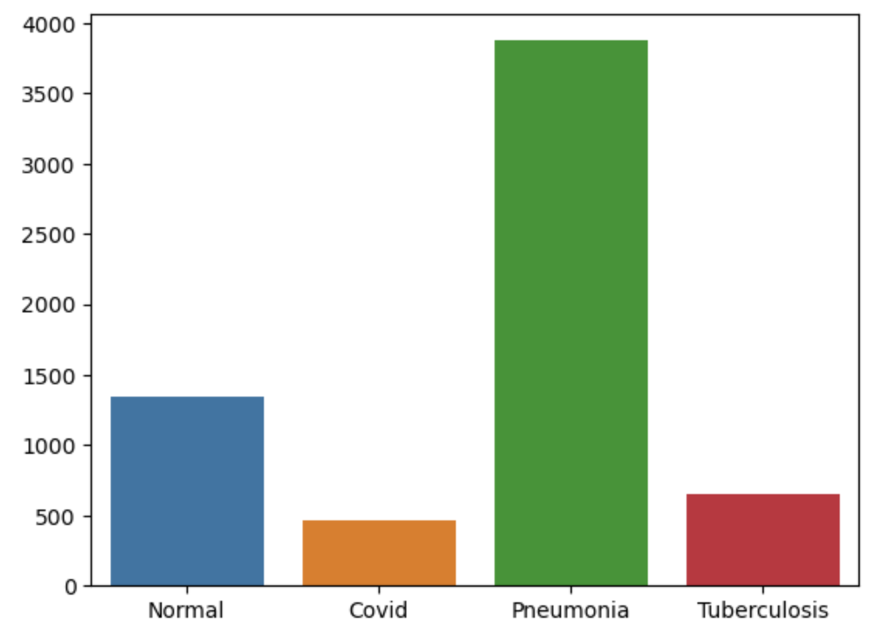
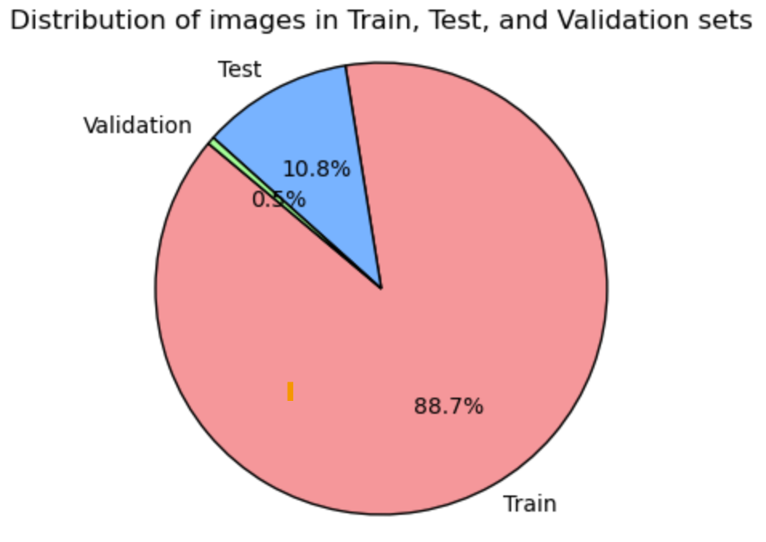

# Pneumonia_Detection

Dataset Description 
Dataset source : Chest X-Ray (Pneumonia,Covid-19,Tuberculosis)  
https://www.kaggle.com/datasets/jtiptj/chest-xray-pneumoniacovid19tuberculosis 
The dataset is organized into 3 folders (train, test, val) and contains subfolders for each image 
category (Normal/Pneumonia/Covid-19/Tuberculosis). A total of 7135 x-ray images are present. 

Dataset Imbalance 
The dataset is highly imbalanced, especially for COVID19 and Tuberculosis classes which have 
significantly fewer samples compared to the Pneumonia and Normal classes.  
The Normal and Pneumonia classes have a relatively larger number of samples compared to the 
COVID19 and Tuberculosis classes. 
In the validation set, the imbalance is also present, though to a lesser extent due to the small 
size of the validation set. 

work done:
The project focuses to create a strong classification 
model to differentiate between normal chest X-rays and the pneumonia, COVID-19,  
tuberculosis by incorporating deep learning techniques, namely ResNeXt and VGG16 
architectures. Effective prediction and management of respiratory infections are made possible 
by deep learning, which provides the healthcare industry with quick and precise data analysis. 
However, the unbalanced availability of data makes it difficult to detect  lung disorders such 
COVID-19, bacterial and viral pneumonias, and tuberculosis (TB) with accuracy. 
(venkataramana &prasad.et.al 2022) The study addresses this by using class balancing and data 
augmentation approaches prior to classification, which improves diagnostic accuracy(Ahmad & 
Rehman.et.al 2023).By combining ResNeXt and VGG16, the suggested multi-level classification 
approach exhibits significant improvements in the project.
